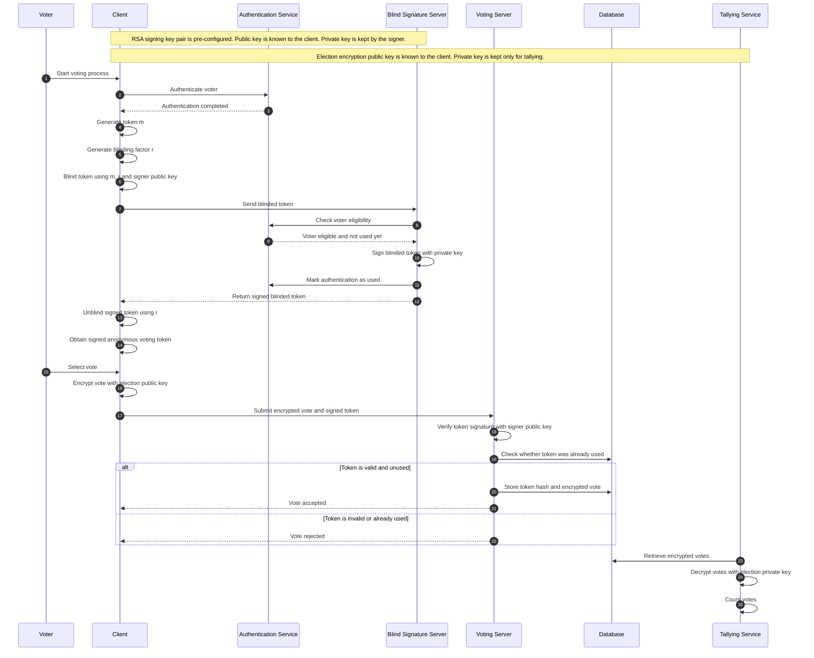

# Authentication Sequence

```mermaid
    sequenceDiagram
        autonumber

        participant Voter
        participant Client
        participant Auth as Authentication Service
        participant Signer as Blind Signature Server
        participant VoteServer as Voting Server
        participant Database
        participant Tally as Tallying Service

        Note over Client,Signer: RSA signing key pair is pre-configured. Public key is known to the client. Private key is kept by the signer.
        Note over Client,Tally: Election encryption public key is known to the client. Private key is kept only for tallying.

        Voter->>Client: Start voting process
        Client->>Auth: Authenticate voter
        Auth-->>Client: Authentication completed

        Client->>Client: Generate token m
        Client->>Client: Generate blinding factor r
        Client->>Client: Blind token using m, r and signer public key

        Client->>Signer: Send blinded token
        Signer->>Auth: Check voter eligibility
        Auth-->>Signer: Voter eligible and not used yet

        Signer->>Signer: Sign blinded token with private key
        Signer->>Auth: Mark authentication as used
        Signer-->>Client: Return signed blinded token

        Client->>Client: Unblind signed token using r
        Client->>Client: Obtain signed anonymous voting token

        Voter->>Client: Select vote
        Client->>Client: Encrypt vote with election public key

        Client->>VoteServer: Submit encrypted vote and signed token
        VoteServer->>VoteServer: Verify token signature with signer public key
        VoteServer->>Database: Check whether token was already used

        alt Token is valid and unused
            VoteServer->>Database: Store token hash and encrypted vote
            VoteServer-->>Client: Vote accepted
        else Token is invalid or already used
            VoteServer-->>Client: Vote rejected
        end

        Tally->>Database: Retrieve encrypted votes
        Tally->>Tally: Decrypt votes with election private key
        Tally->>Tally: Count votes
```
