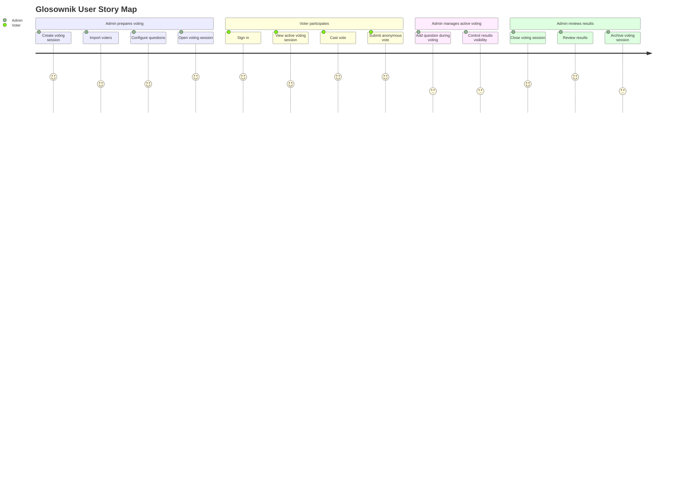

# Story Map

## Stories

| ID | Actor | Story | Related requirements |
| --- | --- | --- | --- |
| US-001 | Admin | As an admin, I want to create and configure a voting session so that voters can participate in a prepared vote. | FR-201 |
| US-002 | Admin | As an admin, I want to import voters so that I can prepare a voting session quickly. | FR-301, FR-302, FR-303, FR-304 |
| US-003 | Admin | As an admin, I want to add questions during an active voting session so that the vote can adapt to meeting decisions. | FR-102 |
| US-004 | Admin | As an admin, I want to control result visibility so that voters see results only when appropriate. | FR-203 |
| US-005 | Admin | As an admin, I want to open, close, and archive voting sessions so that the voting lifecycle is controlled. | FR-204 |
| US-006 | Admin | As an admin, I want to inspect results so that I can understand the outcome of a voting session. | FR-202 |
| US-007 | Voter | As a voter, I want to sign in securely so that only eligible users can vote. | FR-401, FR-402 |
| US-008 | Voter | As a voter, I want to cast one vote per question in an active session so that my choice is counted correctly. | FR-101 |
| US-009 | Voter | As a voter, I want my vote to remain anonymous so that admins cannot connect my identity with my choices. | FR-103 |
